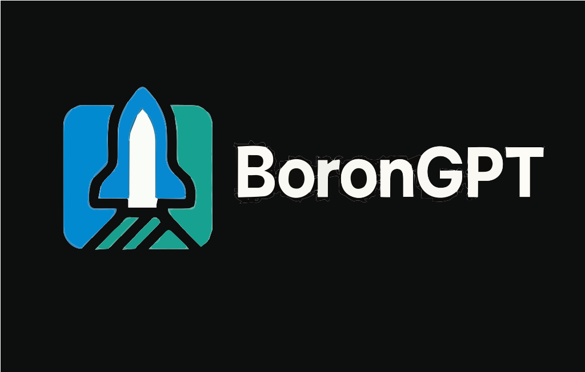

<div align="center">



### BoronGPT - A GPT wrapper that actually builds your MVP

</div>

### Dev Setup
```
git clone https://github.com/bandhan-majumder/BoronGPT
cd BoronGPT
```
then, install al the dependencies with 
```
pnpm install
```
add your Claude-API key and preferred model anme to the .env file by copying
```
mv apps/web/.env.example .env
```
then run the app by
```
pnpm dev
```

### Redis setup (Optional)
```
docker run -d \
  --name redis-cache \
  -p 6379:6379 \
  redis:7.2-alpine
```
based on the url,
your .env values will be like this;
```
REDIS_HOST=localhost
REDIS_PORT=6379
REDIS_PASSWORD= // null (no password)
REDIS_DB=0 // (default)
REDIS_URL=redis://localhost:6379
```
